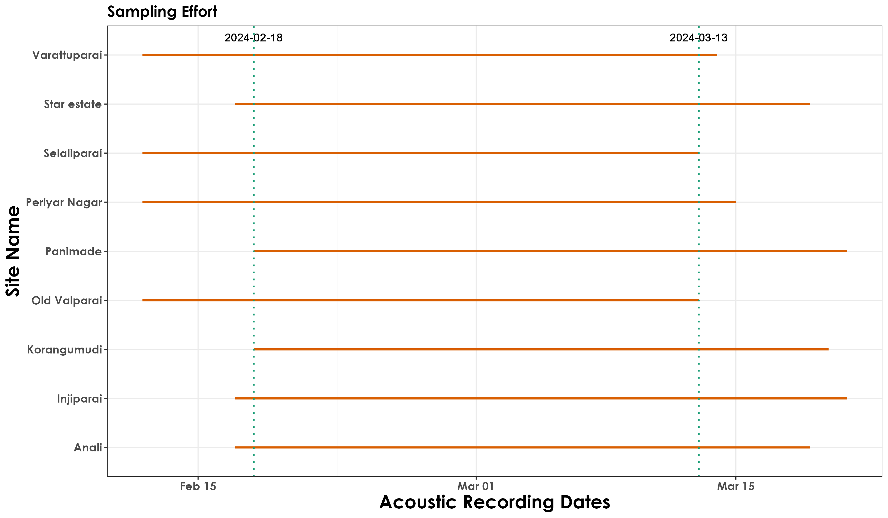
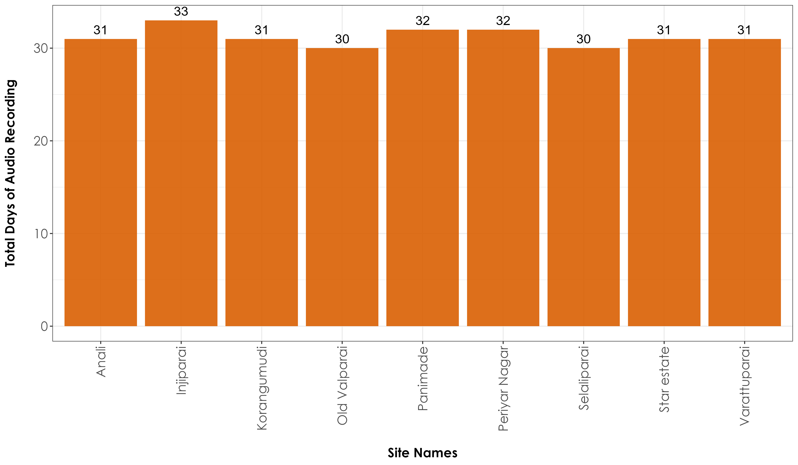
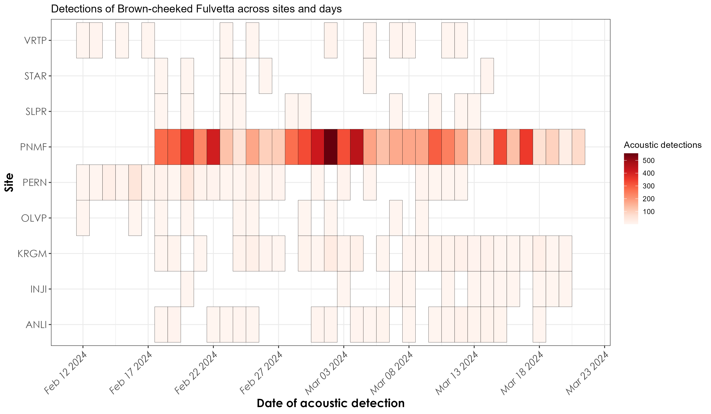
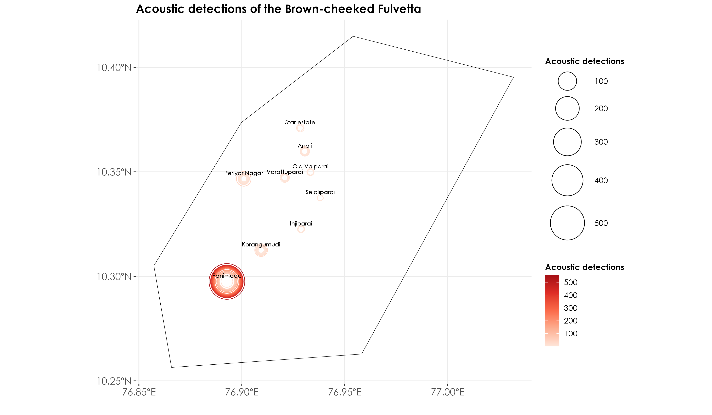
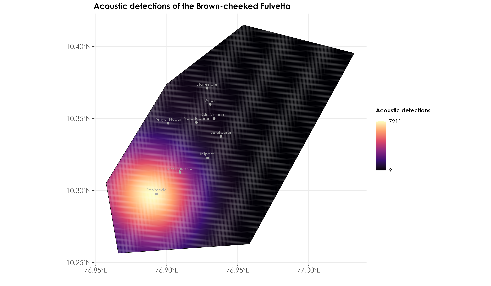

# Analysis of BirdNET detections

In this script, we carry out spatial and temporal analyses of acoustic detections that were thresholded in the previous script. We work with a subset of detections that have a 95% probability of being a true positive.  

## Load necessary libraries
```{r}
library(tidyverse)
library(dplyr)
library(stringr)
library(ggplot2)
library(data.table)
library(extrafont)
library(sf)
library(raster)
library(mapedit)
library(mapview)
library(stars)
library(spatstat)

# for plotting
library(scales)
library(ggplot2)
library(ggspatial)
library(colorspace)
library(scico)
library(RColorBrewer)
library(paletteer)
```

## Load acoustic data and metadata
```{r}
metadata <- read.csv("data/acoustic-metadata.csv")
acoustic_data <- read.csv("results/thresholded-acoustic-detections.csv")
```

## Visualizing sampling effort

How much acoustic data was collected? Using information on the first and last date of recorded acoustic data, we could visualize the total recorded days across months and sites.

```{r}
# ensure structure of dates in the metadata file is date
metadata$first_file_date <- as.Date(metadata$first_file_date)
metadata$last_file_date <- as.Date(metadata$last_file_date)

# extract the common start and end dates across sites
# this is to figure out what are periods across which all sites recorded simultaneously
common_start_date <- max(metadata$first_file_date, na.rm = T)
common_end_date <- min(metadata$last_file_date, na.rm = T)

# visualization
fig_samplingEffort <- metadata %>%
  filter(!is.na(first_file_date)) %>%
  ggplot(., aes(y = site_name)) +
  geom_segment(aes(x = first_file_date, xend = last_file_date, yend = site_name), color = "#d95f02", size = 1) +
  geom_vline(xintercept = as.numeric(common_start_date), linetype = "dotted", color = "#1b9e77", size = 0.8) +
  geom_vline(xintercept = as.numeric(common_end_date), linetype = "dotted", color = "#1b9e77", size = 0.8) +
  geom_text(aes(x = common_start_date, y = Inf, label = format(common_start_date, "%Y-%m-%d")), vjust = 2, hjust = 0.5, color = "black") +
  geom_text(aes(x = common_end_date, y = Inf, label = format(common_end_date, "%Y-%m-%d")), vjust = 2, hjust = 0.5, color = "black") +
  labs(title = "Sampling Effort",
       x = "Acoustic Recording Dates",
       y = "Site Name") +
  theme_bw() +
  theme(
    text = element_text(family = "Century Gothic", size = 14, face = "bold"), plot.title = element_text(
      family = "Century Gothic",
      size = 15, face = "bold"
    ),
    plot.subtitle = element_text(
      family = "Century Gothic",
      size = 15, face = "bold", color = "#1b2838"
    ),
    axis.title = element_text(
      family = "Century Gothic",
      size = 18, face = "bold"
    ),
    legend.position = "top",
    legend.title = element_blank(),
    legend.text = element_text(size = 10)
  )

ggsave(fig_samplingEffort, filename = "figs/fig_sampling_effort.png", width = 12, height = 7, device = png(), units = "in", dpi = 300)
dev.off()

## This visualization showed that all sites concurrently recorded data from 18th February 2024 to 13th March 2024
```



## How much data was recorded at each site?

Creating a bar plot with total number of days of recording at each site. Please refer to the metadata to ascertain the configuration and deployment details for the recorders. 
```{r}
## total number of recorded days
metadata$total_days_recording <- as.numeric(metadata$last_file_date - metadata$first_file_date, na.rm = T)

## visualization
fig_totalRecordedDays <- metadata %>%
  filter(!is.na(first_file_date)) %>%
  ggplot(., aes(x = site_name, y = total_days_recording, fill = site_name)) +
   geom_bar(stat = "identity", position = position_dodge(), fill = "#d95f02", alpha = 0.9) +
  geom_text(aes(label = total_days_recording, hjust = "middle", vjust = -0.5),
    position = position_dodge(), angle = 0, size = 5
  ) +
  theme_bw() +
  labs(
    x = "\nSite Names",
    y = "Total Days of Audio Recording\n"
  ) +
  theme(
    axis.title = element_text(
      family = "Century Gothic",
      size = 14, face = "bold"
    ),
    axis.text = element_text(family = "Century Gothic", size = 14),
    axis.text.x = element_text(angle = 90, vjust = 0.5, hjust = 1),
    legend.position = "none"
  )
  
ggsave(fig_totalRecordedDays, filename = "figs/fig_total_days_audioRecording.png", width = 12, height = 7, device = png(), units = "in", dpi = 300)
dev.off()
```


## Detections by day over time 

```{r}
## run analysis for one species
## let's select the Brown-cheeked Fulvetta

fulvetta <- acoustic_data %>%
  filter(common_name == "Brown-cheeked Fulvetta")

# group detections by date and site_name
fulvetta_detections <- fulvetta %>%
  group_by(common_name, site_name, date) %>%
  summarise(total_detections = n())

# species name and change date structure
name <- unique(fulvetta_detections$common_name)
fulvetta_detections$date <- as.Date(fulvetta_detections$date)

## visualization
fig_fulvetta_detections <-  fulvetta_detections %>%
  ggplot(., aes(x = date, y = site_name, fill = total_detections)) +
  geom_tile(color = "black") + 
    scale_fill_gradientn(colours = c(brewer.pal(9, "Reds"))) +
  scale_x_date(date_labels = "%b %d %Y",
               date_breaks = "5 days") + 
  labs(title = paste0("Detections of ", 
                      name, " across sites and days"),
       x = "Date of acoustic detection",
       y = "Site",
       fill = "Acoustic detections") + 
  theme_bw() +
  theme(
    axis.title = element_text(
      family = "Century Gothic",
      size = 14, face = "bold"
    ),
    axis.text = element_text(family = "Century Gothic", size = 12),
    axis.text.x = element_text(angle = 45, hjust = 1, face = "italic"),
  )

ggsave(fig_fulvetta_detections, filename = "figs/fig_brownCheekedFulvetta_detections_by_day.png", width = 12, height = 7, device = png(), units = "in", dpi = 300)
dev.off()
```



## Bubble map of acoustic detections  

We will visualize acoustic detections in space and time.
```{r}
## load spatial layers (note the commented out lines need to run only once/or replaced with actual shapefiles of Valparai)
# wg <- st_read("data/spatial/WG.shp")
# wg <- st_make_valid(wg)

## exception: remove below code as it won't be required with actual shapefiles

# bbox <- mapview(wg) %>%
#  editMap()
# valparai <- st_as_sf(bbox$finished) %>%
#  `st_crs<-`(4326)

# mapview(valparai)

# save spatial file and reload later when needed
# st_write(valparai, "data/spatial/valparai.shp",
#         driver = "ESRI Shapefile")

# load shapefiles
valparai <- st_read("data/spatial/valparai.shp")

## merge lat-long from metadata with the acoustic_data file
acoustic_data <- left_join(acoustic_data[,-9], metadata[,c(1:4)])

## convert to an sf object
acoustic_data <- st_as_sf(acoustic_data, coords = c("longitude", "latitude"), crs = st_crs(valparai))

## filter by species (Brown-cheeked Fulvetta)
fulvetta <- acoustic_data %>%
  filter(common_name == "Brown-cheeked Fulvetta")

# group detections by date and site_name
fulvetta_detections <- fulvetta %>%
  group_by(common_name, site_name, date) %>%
  summarise(total_detections = n())

## visualization
fig_fulvetta_bubbleMap <- ggplot(data = valparai) +
  geom_sf(fill = NA, color = "black") +
  scale_color_gradientn(colors = c(brewer.pal(5, "Reds")))+
  geom_sf(data = fulvetta_detections, aes(size = total_detections, color = total_detections), shape = 21, fill = NA) +
  geom_text(data = fulvetta_detections, aes(x = st_coordinates(fulvetta_detections)[, "X"], y = st_coordinates(fulvetta_detections)[, "Y"], label = site_name), vjust = -0.9, hjust = 0.5, size = 2.5,
            family = "Century Gothic") +
  scale_size_continuous(range = c(3, 20)) +
  labs(x = '',
       y = '',
       size = 'Acoustic detections', color = 'Acoustic detections', title = "Acoustic detections of the Brown-cheeked Fulvetta") +
  theme_bw() +
  theme(
    plot.title = element_text(
      family = "Century Gothic",
      size = 14, face = "bold"
    ),
    axis.title = element_text(
      family = "Century Gothic",
      size = 14, face = "bold"
    ),
    axis.text = element_text(family = "Century Gothic", size = 12), 
    legend.position = "right",
    legend.title = element_text(family = "Century Gothic", size = 10, face = "bold"), 
    legend.text = element_text(family = "Century Gothic", size = 10), 
    panel.border = element_blank()   
    )    

ggsave(fig_fulvetta_bubbleMap, filename = "figs/fig_brownCheekedFulvetta_bubbleMap.png", width = 12, height = 7, device = png(), units = "in", dpi = 300)
dev.off()
```



## Creating a kernel density map of acoustic detections across Valparai for the Brown-cheeked Fulvetta

```{r}
# convert geographic coordinate system to projected coordinate system
valparai <- valparai %>%
  st_transform(32643)

fulvetta_detections <- fulvetta_detections %>%
  st_transform(32643)

# further group and summarize detections by site_name
fulvetta_cumulative_detections <- fulvetta_detections %>%
  group_by(site_name) %>%
  mutate(total_cumulative_detections = sum(total_detections)) %>%
  distinct(common_name, site_name, total_cumulative_detections, geometry)

## create spatial points object to create KDE plot
fulvetta_spp <- as.ppp(st_coordinates(fulvetta_cumulative_detections), W = as.owin(valparai))

marks(fulvetta_spp) <- fulvetta_cumulative_detections$total_cumulative_detections

## create a stars object prior to plotting using sf & ggplot2 

weights <- fulvetta_spp$marks

density_obj <- stars::st_as_stars(density(fulvetta_spp, dimyx = 300, weights = weights)) # adjust sigma accordingly

## convert back to sf and change the CRS
density_obj <- st_as_sf(density_obj) 
st_crs(density_obj) <- 32643

density_obj <- st_intersection(density_obj, valparai) %>%
  st_transform(4326)

valparai <- valparai %>%
  st_transform(4326)

fulvetta_cumulative_detections <- fulvetta_cumulative_detections %>%
  st_transform(4326)

## visualization
fig_kdePlot_fulvetta <- ggplot() +
geom_sf(data = density_obj, aes(fill = v), color = NA) +
geom_sf(data = valparai, fill = NA, color = "black", linewidth = 0.25) +
  geom_sf(data = fulvetta_cumulative_detections, color = "darkgray", shape = 21, fill = "darkgray") +
  geom_text(data = fulvetta_cumulative_detections, aes(x = st_coordinates(fulvetta_cumulative_detections)[, "X"], y = st_coordinates(fulvetta_cumulative_detections)[, "Y"], label = site_name), vjust = -0.9, hjust = 0.5, size = 2.5,
            family = "Century Gothic", color = "darkgray")+
scale_fill_viridis_c(option = "magma", 
                     name = "Acoustic detections",
                     breaks = c(min(density_obj$v), max(density_obj$v)),labels = c(min(weights), max(weights)))+
theme_bw() +
  labs(x = '',
       y = '',
       size = 'Acoustic detections', color = 'Acoustic detections', title = "Acoustic detections of the Brown-cheeked Fulvetta") +
  theme_bw() +
  theme(
    plot.title = element_text(
      family = "Century Gothic",
      size = 14, face = "bold"
    ),
    axis.title = element_text(
      family = "Century Gothic",
      size = 14, face = "bold"
    ),
    axis.text = element_text(family = "Century Gothic", size = 12), 
    legend.position = "right",
    legend.title = element_text(family = "Century Gothic", size = 10, face = "bold", margin = margin(b = 15)), 
    legend.text = element_text(family = "Century Gothic", size = 10), 
    panel.border = element_blank()   
    ) 

ggsave(fig_kdePlot_fulvetta, filename = "figs/fig_brownCheekedFulvetta_kernelDensityMap.png", width = 12, height = 7, device = png(), units = "in", dpi = 300)
dev.off()
```




